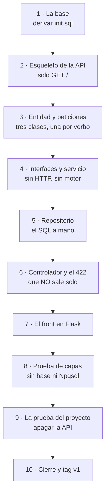

# Plan de la versión 1 — Cátedras Abiertas

> Este documento cuenta **cómo se construyó** la v1 de este ejemplo: qué se
> encontró al revisar el material, qué decisiones hubo que tomar antes de
> escribir una línea, en qué orden se hizo y con qué se verificó.
>
> No es la especificación —esa está en
> [`docs/spec_kit/`](docs/spec_kit/versiones/v1_sede/2_spec.md)— sino el
> relato del camino, con los tropiezos incluidos. Los tropiezos son la parte
> útil.

---

## 0. Lo que queda al terminar

Un sistema de **tres procesos** que se levanta con un comando:

```
FRONT (Flask, Python, :8038) ──HTTP──> API (C#, .NET, :8037) ──SQL──> PostgreSQL (:15461)
```

- La base **completa**: 37 tablas, 6 vistas, 22 rutinas, 7 disparadores.
- El CRUD de **`sede`** de punta a punta, en tres capas con interfaces.
- Sus **pantallas**, con la pareja PUT/PATCH visible.
- Una prueba que corre **con la base apagada**.
- **Cero datos de personas reales.**

## 1. Los insumos

Lo que había en `C:\\...\\proyectoCatedras` al empezar:

| Insumo | Qué es | Qué se hizo con él |
|---|---|---|
| `SOLUCION/fisico_postgres/catedras.sql` | El script completo de la base: 3.719 líneas, 18 bloques numerados | **Se derivó** `db/init.sql` con tres cambios declarados |
| `SOLUCION/MER/*.md` + su Excel | El modelo entidad-relación documentado, entidad por entidad | Se copió a `material_dado/` como referencia |
| `SOLUCION/fisico_postgres/datos/*.csv` | **Siete archivos con datos reales de personas** | **NO se publicaron.** Ver §2 |
| `ApiCatedrasUsbmed/` | Una API en C# con 300 archivos: el sistema real | **No se copió.** Este repositorio es un ejemplo del método, no un fork del sistema |
| Los `.docx` y `.xlsx` de la raíz | Historias de usuario, cronogramas, planes | No se copiaron: no hacen falta para la v1 |

## 2. El primer hallazgo, y el que cambió el plan

Al abrir los siete CSV para ver qué tenían:

| Archivo | Filas | Qué contiene |
|---|---|---|
| `asistente.csv` | **14.808** | Nombre, apellido, nombre completo y **correo institucional** |
| `documento.csv` | **15.517** | Tipo y **número de documento de identidad** |
| `matricula.csv` | 15.349 | Código de programa por persona |
| `catedra.csv` | 5.496 | Eventos (no personal) |
| `sesion.csv` | 5.711 | Sesiones (no personal) |
| `programa.csv` | 105 | Catálogo (no personal) |
| `novedad.csv` | 0 | Vacío |

**Eso no puede ir a un repositorio público.** No es una cuestión de estilo:
son quince mil personas identificadas con su documento de identidad, y este
repositorio se publica en GitHub para que lo lean los estudiantes.

**Se consideró "anonimizar" y se descartó**, porque suena razonable y es peor
de lo que parece: un archivo con los nombres cambiados pero los mismos
códigos, programas y fechas de asistencia **sigue permitiendo reidentificar**
a la gente — y encima da la sensación de que el problema quedó resuelto.

**La decisión:** se quita el bloque de carga y se ponen datos inventados. Y se
quitan **los datos, no el mecanismo**: las tablas de paso, el procedimiento de
carga y las tablas de lote y novedad siguen en la base, se pueden leer y se
pueden ejercitar con datos propios.

Quedó escrito en tres sitios, porque esta es la clase de cosa que no se deja a
la memoria de nadie:

- **[Artículo 8](docs/spec_kit/1_constitution.md)** de la constitución.
- La **cabecera de [`db/init.sql`](db/init.sql)**, con las cifras.
- La decisión **D3** de
  [4_research.md](docs/spec_kit/versiones/v1_sede/4_research.md).
- Y una sección propia —la **G**— en
  [9_checklist.md](docs/spec_kit/versiones/v1_sede/9_checklist.md), que
  incluye la casilla *"alguien buscó en el repositorio, no solo en la base"*.

> **Esa casilla existe porque yo mismo fallé en ella.** Al preparar el
> material copié la carpeta `SOLUCION` completa con `cp -r`, y los siete CSV
> entraron al árbol de trabajo. El `.gitignore` los habría dejado fuera del
> commit, pero estaban en el disco del proyecto. **Ignorar un archivo no es lo
> mismo que no tenerlo**, y el barrido final fue lo que lo encontró.

## 3. Las decisiones antes de programar

### 3.1 El stack: API en C#, front en Flask

La API en **C# / ASP.NET Core con Dapper y Npgsql**, y el front en **Python
con Flask**.

**Que sean lenguajes distintos es la decisión, no un accidente.** Todo el
curso repite que las capas están separadas y que el front solo habla por HTTP.
Con front y API en el mismo lenguaje eso hay que creerlo — siempre queda la
duda de si en algún punto se comparte una clase o un modelo. **Con dos
lenguajes distintos, compartir algo es imposible.**

Y se verifica: apagar la API y comprobar que la pantalla carga **sin datos**.

### 3.2 La tabla: `sede`

De las **once tablas sin clave foránea** que tiene el modelo. No es la más
grande —`registro_asistencia` tiene trece campos y cinco claves foráneas— sino
**la que enseña más por fila**:

| Lo que tiene | Lo que permite mostrar |
|---|---|
| Un campo **opcional** (`direccion`) | La sede virtual no tiene dirección, y viene así **desde el script dado** |
| Un **booleano** nativo | En el JSON sale `true`/`false`, no `1`/`0` |
| **Dos** restricciones de unicidad | Dos **500 por motivos distintos**: `pk_sede` y `uq_sede_nombre` |
| **3 filas sembradas** | El listado no arranca vacío: hay qué mostrar desde el primer arranque |

### 3.3 El motor: PostgreSQL, con lo que eso cambia

Los otros ejemplos del curso en C# hablan con SQL Server. Aquí el modelo viene
en PostgreSQL, y eso cambia **tres cosas, y solo tres**:

| | SQL Server | PostgreSQL |
|---|---|---|
| La conexión | `SqlConnection` | `NpgsqlConnection` |
| El límite | `TOP (@Limite)`, al principio | `LIMIT @Limite`, al final |
| El booleano | `activo = 1` | **`activo = TRUE`** |

**Que la lista quepa en tres filas es el resultado de haber puesto las
interfaces.** Si el servicio conociera la clase del repositorio, cambiar de
motor tocaría medio proyecto.

### 3.4 Los puertos

| Servicio | Puerto |
|---|---|
| API | **8037** |
| Front | **8038** |
| PostgreSQL | **15461** |

Salieron del registro del semestre, donde **ningún puerto se repite**.

## 4. El plan, en 10 pasos

Cada paso termina en algo **que se puede comprobar**. El detalle está en
[8_tasks.md](docs/spec_kit/versiones/v1_sede/8_tasks.md); aquí va el mapa.



| Paso | Qué se hace | Con qué se comprueba |
|---|---|---|
| 1 | Derivar `db/init.sql`: sin la carga real, con datos inventados, sin crear la base | 37 tablas, 3 sedes, **y buscar que no queden datos personales** |
| 2 | `.csproj` con Npgsql, `Dockerfile` con el SDK, `Program.cs` con solo el diagnóstico | `GET /` responde `"version":"v1"` |
| 3 | La entidad y las **tres** clases de petición | `dotnet build` compila; `/swagger` muestra los esquemas |
| 4 | Las dos interfaces y el servicio | El servicio no tiene ningún `using` de ASP.NET ni de Npgsql |
| 5 | El repositorio con Dapper y el ensamblador | `GET /api/sede` devuelve las 3 sedes |
| 6 | Los 6 endpoints y **reemplazar la fábrica del 422** | Los dos 500 y el 422 con su sobre |
| 7 | `cliente_api.py`, las plantillas, los dos botones | Crear desde el formulario, y la pareja PUT/PATCH |
| 8 | `pruebas/` con su propio `.csproj`, **sin Npgsql** | Pasa con la base apagada |
| 9 | Comprobar que el front no menciona la base | Apagar la API: la pantalla carga sin datos |
| 10 | Postman, README, firma del checklist, tag | Los 9 criterios, corridos por una persona |

## 5. Los tropiezos, y a dónde fue cada corrección

> **El criterio de los tres destinos.** Cuando algo falla, la corrección va a
> **uno** de tres lugares, y elegir bien es lo que hace que la próxima vez
> salga mejor:
>
> | Si… | La corrección va a |
> |---|---|
> | No se podía saber sin mirar el sistema | **La especificación** |
> | La spec lo dice y el error se repite **siempre** | **El prompt** |
> | Falló una vez y al señalarlo se arregló | **Quien construye** |

Lo que falló de verdad al montar esta versión:

| Qué pasó | A dónde fue | Por qué |
|---|---|---|
| Los CSV tenían 15.000 personas | **La especificación** (Artículo 8 + C1) | No se podía saber sin abrirlos, y es la decisión más importante de la versión |
| El script hacía `DROP DATABASE` y fallaba con *"cannot drop the currently open database"* | **La especificación** (C3) | El script suponía que alguien lo corría a mano; aquí lo corre el motor |
| El `id_evento_asis` inventado no pasó: son **exactamente 9 dígitos** | **La especificación** ([5_data_model §4](docs/spec_kit/versiones/v1_sede/5_data_model.md)) | Lo dijo `chk_catedra_asis` al rechazar la fila |
| **Todo asistente necesita al menos un correo**, y la visitante externa no tenía | **La especificación** | Lo dijo `chk_asistente_correo` |
| Intenté arreglarlo con un `UPDATE` posterior, y no sirvió | **La especificación** | El `CHECK` se comprueba **al insertar**: la fila nunca llegó a entrar |
| **Sin vinculación vigente no se registra asistencia** | **La especificación** | Lo exige una rutina de la base |
| Copié los CSV al árbol de trabajo con `cp -r` | **La especificación** ([9_checklist §G](docs/spec_kit/versiones/v1_sede/9_checklist.md)) | Por eso existe la casilla *"alguien buscó en el repositorio, no solo en la base"* |
| Mis líneas de prueba con comillas escapadas mandaron JSON roto, y leí 422 donde había 500 | **Quien construye** | Falló una vez, se vio al repetir la prueba limpia. **No es un defecto del sistema: era mi prueba** |

> **Las cinco primeras las dijo el esquema al rechazar los datos**, no un
> documento. Eso es lo que hace un buen modelo relacional — y es la razón de
> que el Artículo 5 diga que la base se respeta en vez de "corregirse".

## 6. Cómo se construye con ayuda de una IA

El prompt completo está en
**[GUIA_IA1.md](docs/spec_kit/versiones/v1_sede/GUIA_IA1.md)**, listo para
pegar. Lo que hay que decirle y no puede deducir:

1. El motor es **PostgreSQL**, no SQL Server — y qué tres cosas cambia eso.
2. **El front va en Flask** mientras la API es de C#, y no debe "unificar el
   stack".
3. **El 422 no sale solo**: hay que reemplazar la fábrica de respuestas.
4. El nombre único **lo defiende la base**, y no debe agregar una consulta
   previa para devolver un 409 "más amable" — no funcionaría.
5. **Los datos personales no se publican.** Si le parece útil cargar esos
   CSV, la respuesta es no.

Y la lista de lo que hay que revisarle está en la §3 de esa guía.

## 7. Dónde vamos

**La v1 está TERMINADA y etiquetada `v1`.** Los nueve criterios se verificaron
contra el sistema corriendo, no de palabra.

| Paso | Estado |
|---|---|
| 1 — La base de datos | ✅ 37 tablas, 6 vistas, 3 sedes, **sin datos personales** |
| 2 — Esqueleto de la API | ✅ hecho |
| 3 — Entidad y peticiones | ✅ hecho |
| 4 — Interfaces y servicio | ✅ hecho |
| 5 — Repositorio | ✅ hecho |
| 6 — Controlador y el 422 | ✅ hecho — los dos 500 comprobados |
| 7 — El front en Flask | ✅ hecho |
| 8 — Prueba de capas | ✅ pasa con la base apagada |
| 9 — La prueba del proyecto | ✅ API apagada: la pantalla carga sin datos |
| 10 — Cierre y tag `v1` | ✅ hecho |

**Lo único que queda abierto, y a propósito:** el
[`9_checklist.md`](docs/spec_kit/versiones/v1_sede/9_checklist.md) está **sin
firmar**. Ese documento dice que **las casillas las marca una persona**, y esa
firma no la puede poner quien construyó.

Lo que sigue está en el
[mapa de versiones](docs/spec_kit/versiones/0_mapa_versiones.md): la **v2** son
las demás tablas sin clave foránea, y ahí aparecerá la pregunta de cuándo
conviene **generalizar** el patrón en vez de copiarlo diez veces.
