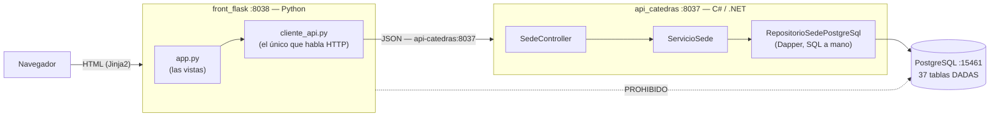

# Especificación — Versión 1: el CRUD de `sede`

> **Versión 1** ([mapa](../0_mapa_versiones.md)) · Rige la
> [constitución](../../1_constitution.md).
>
> | Documento | Contenido |
> |---|---|
> | [2_spec.md](2_spec.md) | QUÉ construir y los criterios de aceptación |
> | [3_plan.md](3_plan.md) | CÓMO: el stack, las capas y sus decisiones |
> | [4_research.md](4_research.md) | Las decisiones, con lo que se descartó |
> | [5_data_model.md](5_data_model.md) | La tabla, sus datos y quién escribe qué |
> | [6_contracts.md](6_contracts.md) | Los endpoints y las pantallas |
> | [7_quickstart.md](7_quickstart.md) | Arranque y smoke test |
> | [8_tasks.md](8_tasks.md) | El orden de construcción por fases |
> | [9_checklist.md](9_checklist.md) | La compuerta 3: se firma ANTES de programar |
> | [GUIA_IA1.md](GUIA_IA1.md) | Construirla con ayuda de una IA |
>
> Las **historias de usuario** que originan estos requisitos están en
> [`HISTORIAS_DE_USUARIO.md`](../../../../HISTORIAS_DE_USUARIO.md).

---

## 1. Propósito

Construir la primera rebanada vertical del sistema de Cátedras Abiertas: el
CRUD de **`sede`** de punta a punta, con **API en C# y front en Flask**, contra
la base PostgreSQL que el proyecto entrega.

La v1 no busca cubrir el modelo —son 37 tablas—: busca **dejar el patrón
montado y verificado**, y demostrar de paso algo que se dice mucho y se
comprueba poco: que **el front y la API pueden estar en lenguajes distintos**
porque lo único que los une es un contrato HTTP.

## 2. Alcance

**Incluye**

- La base completa —**37 tablas**, 6 vistas, sus rutinas y disparadores—
  creada en el primer arranque, con **datos hipotéticos**.
- El CRUD de `sede` en la API: listar (con límite), obtener, crear, reemplazar,
  actualizar parcialmente y eliminar.
- **Borrado lógico**: `DELETE` marca `activo = FALSE` y los listados filtran.
- El front con las pantallas de `sede`: listar, crear, editar y eliminar.
- **La pareja PUT/PATCH visible**: la misma pantalla, dos botones.
- La prueba de capas, sin base de datos **y sin el paquete del motor**.

**NO incluye** — y no se anticipa nada de esto (Artículo 1)

- Ninguna otra de las 37 tablas.
- **Ningún dato de personas reales** (Artículo 8).
- La carga masiva desde los archivos del ASIS: el mecanismo está en la base,
  pero la v1 no lo expone ni lo ejecuta.
- Autenticación, roles y permisos.
- Las rutinas de la base como endpoints: eso es la v4.
- Reactivar una sede inactiva.

## 3. Requisitos funcionales

### RF1 — Listar sedes
`GET /api/sede` → 200 con el sobre `{tabla, limite, total, datos:[…]}`.
- Devuelve **solo las activas**.
- `limite` opcional (entero > 0; por defecto 1000).
- Sin filas activas → **204** sin cuerpo.

### RF2 — Obtener por código
`GET /api/sede/{idSede}` → 200. Inexistente **o inactiva** → 404.

### RF3 — Crear
`POST /api/sede` con `{idSede, nombre, esVirtual}` obligatorios y `direccion`
opcional.
- Nace con `activo = TRUE`.
- **Dos** motivos distintos de 500, los dos de la base: código repetido
  (`pk_sede`) y **nombre repetido** (`uq_sede_nombre`).

### RF4 — Reemplazar (PUT)
`PUT /api/sede/{idSede}` con `nombre` y `esVirtual` obligatorios.
- Falta uno → 422. Devuelve `filasAfectadas`; inexistente → 404.

### RF5 — Actualizar parcialmente (PATCH)
Solo se modifican los campos enviados. Cuerpo vacío → 400.

### RF6 — Eliminar (borrado lógico)
`DELETE /api/sede/{idSede}` marca `activo = FALSE`. Inexistente o ya inactiva
→ 404. **La fila no desaparece.**

### RF7 — Diagnóstico
`GET /` → JSON con mensaje, versión (`"v1"`) y la ruta de los contratos.

### RF8 — Las pantallas
`/sedes` (listar), `/sedes/nueva`, `/sedes/<codigo>/editar` con **los dos
botones**, y `/sedes/<codigo>/eliminar` por POST.
- El **opcional en blanco no se envía como cadena vacía**: se envía nulo.
- Un 422 devuelve el formulario **conservando lo digitado**.
- Con la API caída, la página **carga** y lo dice — sin datos.

## 4. Requisitos no funcionales

- **Un solo comando** levanta los tres servicios (Artículo 4).
- **El front no conoce ninguna cadena de conexión.**
- **SQL a mano y parametrizado** (Artículo 2).
- Todo en español (Artículo 9); documentación en `/swagger`.

## 5. Criterios de aceptación

1. **Un solo comando.** `docker compose up -d --build` deja corriendo los tres
   servicios. `GET http://localhost:8037/` responde `"version":"v1"`, y
   `http://localhost:8038/sedes` responde 200.
2. **El catálogo dado se ve.** La API devuelve las **3 sedes** del script, y
   las tres aparecen en la pantalla. La virtual se muestra **sin dirección**.
3. **Crear desde el formulario.** Una sede creada en el front aparece en
   `GET /api/sede/{codigo}`.
4. **El opcional en blanco queda nulo**, no en cadena vacía — comprobable en
   la base.
5. **La pareja PUT/PATCH.** Con el nombre borrado: el botón PUT deja la
   pantalla con un **422**; el botón PATCH, sobre **el mismo formulario**,
   guarda.
6. **Los desenlaces de error.** `PATCH {}` → 400 · `?limite=0` → 400 ·
   inexistente → 404 · **código repetido → 500** · **nombre repetido → 500**,
   y el detalle nombra `uq_sede_nombre`.
7. **El borrado es lógico, y se verifica.** Tras el `DELETE` la sede sale del
   listado, un segundo `DELETE` responde 404, **y la fila sigue en la base**
   con `activo = FALSE`.
8. **La prueba del proyecto.** Con `docker compose stop api-catedras`, la
   pantalla `/sedes` **sigue cargando** y muestra *"El servicio no está
   disponible"* — **sin datos**.
9. **Prueba de capas.** El proyecto `pruebas/` ejecuta el servicio con un
   repositorio de mentiras y **sin referenciar Npgsql ni Dapper**, y pasa con
   la base apagada.

## 6. Clarificaciones

> La **compuerta 1** del método: las ambigüedades detectadas ANTES de planear,
> con su respuesta y su razón.

| # | La pregunta | La respuesta, con su razón | Dónde quedó |
|---|---|---|---|
| **C1** | El script dado carga **siete CSV con datos reales**: 14.808 personas con nombre y correo, y 15.517 números de documento. ¿Se publican? | **No.** Se quitó el bloque 13/18 completo. Publicar la identidad de quince mil personas en un repositorio público es un problema de protección de datos, y ninguna necesidad didáctica lo justifica. **Se quitaron los datos, no el mecanismo**: las tablas de paso y el procedimiento de carga siguen ahí | `db/init.sql` cabecera · Artículo 8 |
| **C2** | Sin esos datos la base queda casi vacía. ¿Se deja así? | **No: se agregan datos HIPOTÉTICOS** y pocos — 3 programas, 2 cátedras, 4 sesiones, 5 asistentes con nombres inventados. Que sean pocos es a propósito: un catálogo de 15.000 filas no enseña nada que no enseñen cinco, y hace lento cada arranque | `db/init.sql` bloque 13 |
| **C3** | El script hace `DROP DATABASE` y `CREATE DATABASE`. ¿Se conserva? | **No.** Aquí la base la crea **Docker** con `POSTGRES_DB`, y el motor ejecuta el script **ya conectado** a ella: un `DROP DATABASE` sobre la base propia falla siempre. El original suponía que alguien lo corría a mano desde `psql` | `db/init.sql` bloque 1 |
| C4 | ¿Sobre qué tabla se hace la v1? | **`sede`**, de las once sin clave foránea. No es la más grande: es la que enseña más por fila — un opcional, un booleano y **dos** restricciones de unicidad distintas | `5_data_model` |
| C5 | El front, ¿en qué lenguaje? | **Python con Flask**, mientras la API es C#. Es deliberado: si el front tuviera que estar en C# para funcionar, el acoplamiento estaría en algún sitio | Artículo 4 · [D1](4_research.md) |
| C6 | Una sede inactiva, ¿se puede consultar por su código? | **No: responde 404.** Si el listado las filtra, individualmente tampoco existen | RF2 · RF6 |
| C7 | ¿Y un segundo `DELETE`? | **404**, por consecuencia de C6 | RF6 · criterio 7 |
| C8 | `?limite=0` o negativo, ¿422 o 400? | **400.** La forma del dato es correcta; lo que se rompe es una regla de negocio | RF1 |
| C9 | Nombre repetido, ¿lo valida la API? | **No: lo defiende la base** con `uq_sede_nombre`, y responde 500. Duplicar esa comprobación en la API le daría dos dueños a la misma regla | RF3 · criterio 6 |
| C10 | La dirección vacía en el formulario, ¿se envía como `""`? | **No: se envía nulo.** Vacío y "no lo tiene" no son lo mismo, y la base los guarda distinto | RF8 · criterio 4 |

## 6.1 Una nota sobre la imagen corporativa

El front de esta versión **ya usa** los colores y las fuentes del Manual de
Identidad Visual Corporativa: están en
[`front_flask/static/marca.css`](../../../../front_flask/static/marca.css).

**Pero eso no es un criterio de aceptación de la v1**, y conviene decir por
qué, porque hubo que corregirlo:

1. **El curso pone la imagen corporativa en la v4**
   (`0_METODOLOGIA.md` §2), junto con el dashboard y la publicación. Ahí es
   donde se evalúa que esté completa.
2. **La v1 se cerró sin ese criterio.** Agregárselo después habría sido
   reescribir una versión ya etiquetada — justo lo que el Artículo 1 prohíbe.

Así que el trabajo de la marca **queda hecho** —era una mejora, y las mejoras
no esperan— pero se **evalúa donde corresponde**: en la v4.

> **Esto pasó de verdad, y se deja escrito.** Al aplicar el manual de marca se
> le agregó a esta spec un décimo criterio, cuando el tag `v1` ya estaba
> puesto. Durante un rato el documento prometió algo que lo etiquetado no
> contenía. **Es el mismo defecto contra el que sirve todo este método**, y la
> lección es simple: **una vez que hay tag, lo que llega después es de la
> versión siguiente.**

## 7. Definición de TERMINADA

1. Los **9 criterios** pasan, verificados **por una persona** con
   [7_quickstart.md](7_quickstart.md).
2. [9_checklist.md](9_checklist.md) está en verde y **firmada**.
3. No queda ningún `[NECESITA ACLARACIÓN: …]`.
4. Se hace commit y **tag `v1`**.
