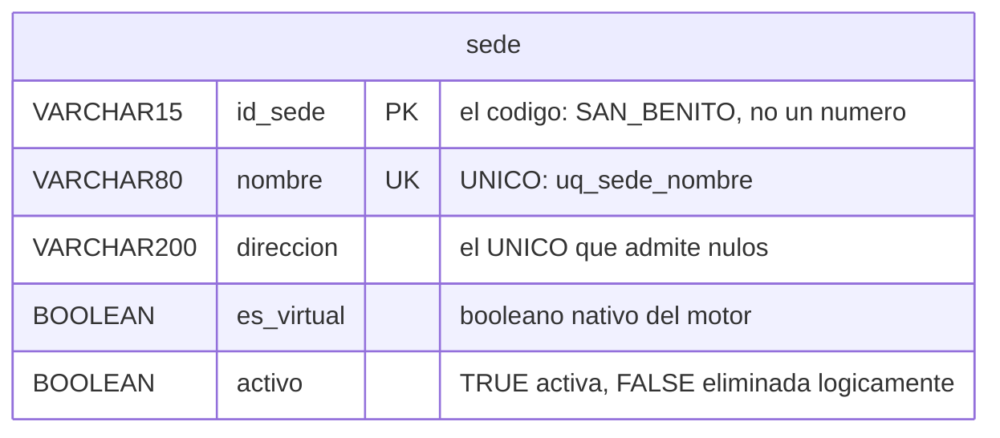

# Modelo de datos — Versión 1: la base dada y `sede`

> **Versión 1** ([mapa](../0_mapa_versiones.md)) · Rige la
> [constitución](../../1_constitution.md).
>
> | Documento | Contenido |
> |---|---|
> | [2_spec.md](2_spec.md) | QUÉ construir y los criterios de aceptación |
> | [3_plan.md](3_plan.md) | CÓMO: el stack, las capas y sus decisiones |
> | [4_research.md](4_research.md) | Las decisiones, con lo que se descartó |
> | [5_data_model.md](5_data_model.md) | La tabla, sus datos y quién escribe qué |
> | [6_contracts.md](6_contracts.md) | Los endpoints y las pantallas |
> | [7_quickstart.md](7_quickstart.md) | Arranque y smoke test |
> | [8_tasks.md](8_tasks.md) | El orden de construcción por fases |
> | [9_checklist.md](9_checklist.md) | La compuerta 3: se firma ANTES de programar |
> | [GUIA_IA1.md](GUIA_IA1.md) | Construirla con ayuda de una IA |

---

## 1. La base viene completa; la v1 nombra una tabla

La base `catedras` se crea con sus **37 tablas**, 6 vistas, 22 rutinas y 7
disparadores desde el primer arranque (Artículo 5). Lo que la v1 puede
**nombrar en el código** es **una sola**: `sede`.

**Y viene con tres cosas declaradas**, todas en la cabecera de `db/init.sql`:

| | Qué se hizo | Por qué |
|---|---|---|
| **C1** | Se quitó el bloque 13/18, "Carga REAL del ASIS" | Cargaba 14.808 personas identificadas y 15.517 documentos. **No se publica** |
| **C2** | Se agregó un bloque 13 con datos hipotéticos | Para que el sistema tenga algo que mostrar, sin usar a nadie real |
| **C3** | Se quitó el `DROP/CREATE DATABASE` del bloque 1 | Aquí la base la crea Docker, y el script corre **ya conectado** a ella |

## 2. La tabla `sede`

| Columna | Tipo | Regla |
|---|---|---|
| `id_sede` | `varchar(15)` | **PK** — el código, y es TEXTO: `SAN_BENITO`, no un número |
| `nombre` | `varchar(80)` | No nulo, y **ÚNICO** (`uq_sede_nombre`) |
| `direccion` | `varchar(200)` | **El único que admite nulos**: la sede virtual no tiene |
| `es_virtual` | `boolean` | No nulo, por defecto `false` |
| `activo` | `boolean` | Borrado lógico. **Ya venía en el esquema**: no hubo que agregarlo |

**Dos detalles que la distinguen de las tablas de los otros ejemplos del
curso:**

1. **`activo` ya estaba.** En los otros módulos hubo que agregar esa columna al
   script dado; aquí el equipo que diseñó el modelo ya la había puesto. **Se
   nota cuando un esquema lo escribió alguien que pensó en el borrado lógico
   desde el principio.**
2. **El `UNIQUE` sobre el nombre** da un 500 por un motivo distinto al de la
   llave primaria. Son **dos defensas**, y las dos son de la base (ver
   [D6](4_research.md)).

## 3. Los datos: los que trae el script

`sede` arranca con **3 filas**, sembradas por el propio script dado:

| `id_sede` | `nombre` | `direccion` | `es_virtual` |
|---|---|---|---|
| `SAN_BENITO` | Campus San Benito | Carrera 56C 51-110, Medellin | `false` |
| `BELLO` | Campus Bello | Calle 45 61-40, Bello | `false` |
| `VIRTUAL` | Virtual | **`NULL`** | `true` |

**La tercera fila es la que enseña:** viene con la dirección nula desde el
script. No es un caso raro que haya que provocar — está en los datos dados, y
por eso el front tiene que saber mostrar una celda sin dirección desde el
primer arranque.

## 4. Los datos hipotéticos (C2)

Lo que reemplaza a la carga real, en las tablas que la v1 **no nombra** pero
que existen:

| Tabla | Filas | Qué son |
|---|---|---|
| `programa_academico` | 3 | Ingeniería de Sistemas, Industrial, Psicología |
| `catedra` | 2 | Códigos `99xxxxxxx`, para que se note que son de ejemplo |
| `sesion` | 4 | Dos por cátedra, en el periodo `2026-1` |
| `asistente` | 5 | **Nombres inventados**: Ana Maria Ejemplo Prueba, etc. |
| `documento_asistente` | 5 | Números en el rango `90000000x` |
| `programa_asistente` | 4 | Los cuatro internos, matriculados |
| `vinculacion_asistente` | 5 | Cuatro ESTUDIANTE y una COLEGIO |

**Cuatro reglas del esquema aparecieron al escribir estos datos**, y las cuatro
son buen material:

1. `id_evento_asis` son **exactamente 9 dígitos** (`chk_catedra_asis`).
2. **Todo asistente necesita al menos un correo** (`chk_asistente_correo`): sin
   correo no hay cómo enviarle la clave de acceso.
3. Esa restricción **se comprueba al insertar**, así que "arreglarla" con un
   `UPDATE` posterior no sirve: la fila nunca llegó a entrar.
4. **Sin vinculación vigente no se puede registrar asistencia**: lo exige una
   rutina de la base, y los asistentes inventados no la tenían al principio.

> Ninguna de las cuatro estaba en un documento: **las dijo el esquema al
> rechazar los datos**. Eso es lo que hace un buen modelo relacional — y es la
> razón de que el Artículo 5 diga que la base se respeta.

## 5. Invariantes: quién escribe qué

| Dato | Dueño | La API… |
|---|---|---|
| `id_sede` | Quien crea la sede | Lo escribe **solo** en el `POST` |
| `nombre`, `direccion`, `es_virtual` | La API | Los escribe en `POST`, `PUT` y `PATCH` |
| `activo` | La API, pero **solo** por `DELETE` | **Tiene prohibido** recibirlo en el cuerpo |
| La unicidad del nombre | **La base** | No la comprueba: recibe el 500 y lo traduce |
| Las otras 36 tablas | Nadie, en la v1 | No las nombra |

## 6. Reglas de esta versión

1. Toda consulta va **parametrizada**.
2. Todo `SELECT` de listado lleva `WHERE activo = TRUE`.
3. La v1 no crea, altera ni borra objetos de la base.
4. **Ningún dato de personas reales** entra al repositorio (Artículo 8).
