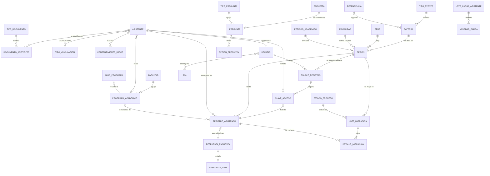
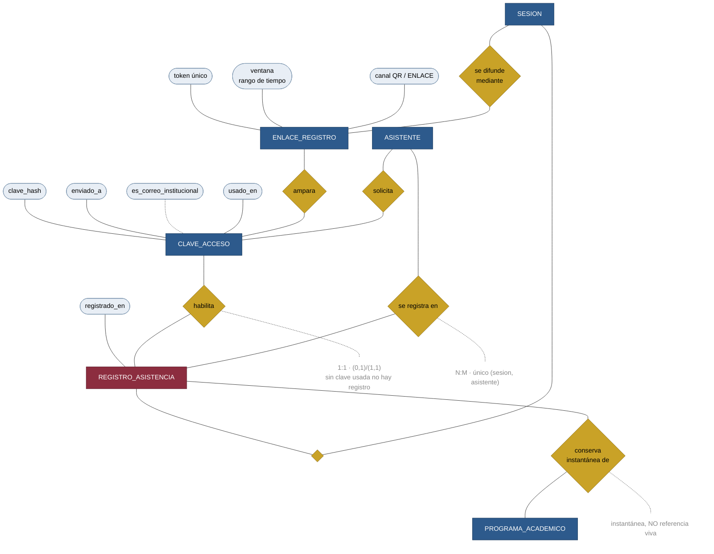
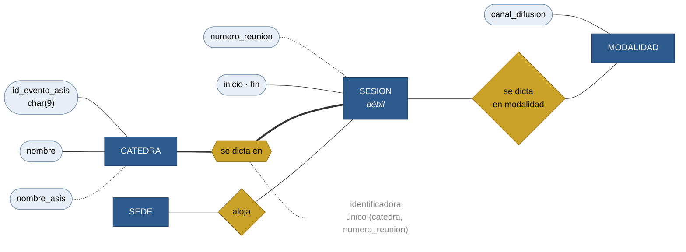

# 10 · Los diagramas

**Notación:** Chen, por indicación expresa del profesor Carlos Castro en `19:11`, viendo un diagrama de pata de gallina: *«por eso es que a mí no me gustan este tipo de modelos»*.

---

## Convenio gráfico

| Símbolo | Significa | Color en los diagramas |
|---|---|---|
| **Rectángulo** | Entidad | Azul |
| Rectángulo **rojo** | La entidad central del subsistema | Rojo |
| **Rombo** | Relación — siempre un **verbo** | Ámbar |
| Rombo de **doble línea** | Relación **identificadora** de una entidad débil | Ámbar, borde doble |
| **Óvalo** | Atributo | Gris azulado |
| Óvalo con nombre <u>subrayado</u> | Identificador | |
| Línea **punteada** hacia el óvalo | Atributo **derivado** | |
| Texto gris suelto | Cardinalidad y min-max | |

---

## El archivo de Draw.io

👉 **[`drawio/MER-CatedrasAbiertas-Chen.drawio`](drawio/MER-CatedrasAbiertas-Chen.drawio)** — el MER completo, **7 páginas**, en notación de Chen.

Se abre en [app.diagrams.net](https://app.diagrams.net) (*Archivo → Abrir desde → Dispositivo*), en la aplicación de escritorio de Draw.io o en la extensión de VS Code.

| Página | Contenido | Formas |
|---|---|---:|
| **00 · Vista general** | Las 33 entidades y las 35 relaciones, sin atributos | 71 |
| 01 · Bloque A | Asistentes e identidad, **con atributos** | 29 |
| 02 · Bloque C | Cátedras, sesiones y sedes | 28 |
| **03 · Bloque D** | **Acceso y registro — el núcleo** | 32 |
| 04 · Bloque E | Encuesta parametrizable | 24 |
| 05 · Bloque F | Integración con el ASIS | 29 |
| 06 · Bloques B y G | Académico, seguridad y configuración | 29 |

Cada página lleva **notas amarillas** que explican las decisiones difíciles en el sitio donde se ven: por qué `numero` es multivaluado, por qué `nombre_asis` es derivado, por qué la ventana es un rango y no dos columnas, y por qué las dos instantáneas del registro no son redundancia.

> **Es editable.** El archivo se genera con [`drawio/generar_drawio.py`](drawio/generar_drawio.py), pero una vez abierto se puede reorganizar a mano: mover cajas, enderezar aristas y exportar a PNG o PDF desde *Archivo → Exportar como*. **Si lo reorganiza, no vuelva a ejecutar el generador**: sobrescribiría su trabajo.

---

## Las seis vistas en Mermaid

| # | Vista | Qué muestra | Fuente |
|---|---|---|---|
| 00 | **General** | Las 33 entidades y sus relaciones, sin atributos | [`.mmd`](mermaid/00-vista-general.mmd) |
| 01 | **Asistentes e identidad** | Bloque A con atributos, en Chen | [`.mmd`](mermaid/01-vista-asistentes-chen.mmd) |
| 02 | **Cátedras, sesiones y sedes** | Bloque C con la relación identificadora | [`.mmd`](mermaid/02-vista-catedras-chen.mmd) |
| **03** | **Acceso y registro** | **El núcleo.** Enlace → clave → registro | [`.mmd`](mermaid/03-vista-acceso-registro-chen.mmd) |
| 04 | **Encuesta** | Bloque E, con la participación no declarativa | [`.mmd`](mermaid/04-vista-encuesta-chen.mmd) |
| 05 | **Integración con el ASIS** | Bloque F, con la copia de lo enviado | [`.mmd`](mermaid/05-vista-integracion-chen.mmd) |

> **Sobre los formatos.** Mermaid es el formato en que se **mantiene** el modelo: es texto, se versiona en git y se ve el cambio en un `diff`. Para la **entrega** al profesor Carlos Castro conviene además exportarlo a Draw.io o a PNG, que es el formato que se proyecta. La conversión se hace desde estos mismos archivos.

---

## Vista 00 · General

Las 33 entidades. Sin atributos, para que quepa.



**Cómo leerla.** Los tres puntos donde converge todo son `ASISTENTE`, `SESION` y `REGISTRO_ASISTENCIA`. Si se tapan esas tres cajas, el diagrama se deshace en siete islas — que son exactamente los siete bloques.

---

## Vista 03 · Acceso y registro — el núcleo

Es la vista que hay que saber explicar de memoria en la sustentación.



**Las tres cosas que dice este diagrama y que hay que poder defender:**

1. **`CLAVE_ACCESO — habilita — REGISTRO` es `(1,1)` por el lado del registro.** No hay registro sin clave usada. Es la traducción exacta de *«si no, yo te registro a vos y vos me registrás a mí»* (`1:04:51`).
2. **La ventana es un atributo único**, no dos. Eso permite preguntar «¿está este instante dentro?» con una sola operación, y evita que existan dos enlaces solapados de la misma sesión.
3. **La línea hacia `PROGRAMA_ACADEMICO` es una instantánea.** Parece una clave foránea normal y se comporta distinto: no se actualiza nunca.

---

## Vista 02 · La relación identificadora

`CATEDRA — se dicta en — SESION` se dibuja con **doble rombo** porque `SESION` es entidad débil: su identificador incluye el de `CATEDRA`.



**Los dos derivados están en línea punteada:** `nombre_asis` y `numero_reunion`. Son los dos que **no se digitan**, y son los dos que eliminan trabajo manual del procedimiento actual.

---

## Cómo exportar a Draw.io y a PNG

Los `.mmd` son la fuente. Para producir los formatos de entrega:

```bash
# PNG, con Mermaid CLI
npx -y @mermaid-js/mermaid-cli -i mermaid/03-vista-acceso-registro-chen.mmd \
                               -o imagenes/03-acceso-registro.png -b white -s 3

# Todos de una vez
for f in mermaid/*.mmd; do
    npx -y @mermaid-js/mermaid-cli -i "$f" -o "imagenes/$(basename ${f%.mmd}).png" -b white -s 3
done
```

Para Draw.io: *Extras → Editar diagrama* admite pegar Mermaid directamente, y desde ahí se reorganiza a mano y se guarda como `.drawio`.

> **Pendiente de la fase.** Las imágenes no se generan aquí porque exigen Node y descarga de paquetes. Los `.mmd` **renderizan directamente en GitHub**, que es donde el profesor Hugo Nelson y el profesor Carlos Castro los van a ver primero.

---

**Anterior:** [09 · Relaciones](09-Relaciones-del-Proyecto.md) · **Siguiente:** [11 · Acceso y registro](11-MER-de-Acceso-y-Registro.md)
